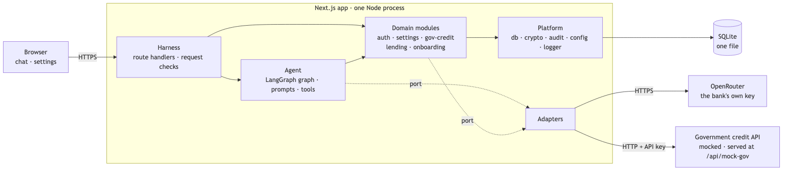

# Bank Assistant

A LangGraph.js chat assistant for a small Sri Lankan bank. Customers check whether they can get a loan, apply for one, and start opening an account. **The LLM talks; code decides.** Identity, money, consent and data access never depend on what the model says.

## What it guarantees

Each guarantee is enforced in code and proven by a deterministic test that names its ID. Search the ID to find the proof.

| Guarantee | How | Proof |
|---|---|---|
| Identity comes only from the signed-in session | Tools take no identity arguments, and NIC-shaped text is stripped before the model sees a message | [`P0-02`](src/server/harness/chat-input.test.ts), [`P0-03`](src/server/agent/loan-flow.gates.test.ts) |
| No credit check without a fresh password and recorded consent | The gates are graph nodes, not prompt instructions; the model can't skip them | [`P0-01`, `P0-03`](src/server/agent/loan-flow.gates.test.ts) |
| Never a sixth government call in a day | A call slot is taken atomically before every attempt, retries included | [`P1-04`](src/server/modules/gov-credit/budget.test.ts) |
| Rules decide; the model never sees the score | A deterministic rules engine sets the outcome; the model gets a situation label | [`P0-07`, `P0-08`](src/server/modules/lending/decide.test.ts) |
| One customer can't reach another's conversation | Every conversation route checks the owner and answers "not found" otherwise | [`P0-04`](src/server/agent/conversations/ownership.test.ts) |
| A reply is checked before anyone sees it | Replies are buffered, then validated against the decision in state | [`P0-05`, `P0-06`](src/server/agent/validate-reply.test.ts) |

The full failure catalogue (19 P0 cases, each with its test) is [`SPEC.md` §8](docs/SPEC.md#8-failure-cases). Two checks are best-effort, so evals measure them instead: spotting a claimed outcome, and spotting a repeated line of the assistant's instructions, in a reply. Neither can change an outcome; only code sets one.

## Run it

You need Node 25 (see `.nvmrc`), pnpm 10 and an [OpenRouter](https://openrouter.ai) API key.

**1. Install**

```bash
pnpm install
cp .env.example .env.local
```

**2. Fill in `.env.local`**

| Setting | What to put |
|---|---|
| `OPENROUTER_API_KEY` | Your OpenRouter key |
| `APP_ENCRYPTION_KEY` | A new random key: `node -e "console.log(require('crypto').randomBytes(32).toString('base64'))"` |
| `DEMO_MODE` | Leave it as `true` |

**3. Create the database and start**

```bash
pnpm db:setup   # creates bank.db with ten demo customers
pnpm dev        # http://localhost:3000
```

**4. Sign in**

| Customer number | Password |
|---|---|
| `C1001` to `C1010` | `Demo@1234` |

The government credit API is a mock built into the app, so there is nothing else to set up.

**Tests.** They don't need an OpenRouter key, because a scripted model stands in for the LLM.

```bash
pnpm test                               # unit, module and graph tests
pnpm exec playwright install chromium   # once, before the first browser run
pnpm test:e2e                           # browser tests
```

## Try it

**Pick a customer.** Each one is set up to reach a particular ending.

| Customer | What happens |
|---|---|
| C1001, C1008, C1010 | Eligible, then an approved application after you confirm |
| C1002 | Not eligible: credit profile |
| C1007 | Not eligible: repayments too high |
| C1009 | Not eligible: the amount is over the limit for their band |
| C1003 | Referred to a loan officer: a borderline case |
| C1004 | Referred: no credit history |
| C1006 | Referred: no income on the bank's record |
| C1005 | Already has an open application, so no new check |

To try a customer again, go to **Settings → Reset my demo data**.

The other journeys: **I'm new → Open an account** on the sign-in screen (no sign-in needed), **Talk to a person** in the chat, and **Settings** for the model per assistant role.

**See why a case ended the way it did.** In demo mode the chat header has a **Behind the scenes** button: the panel icon at the top right, next to Settings. It opens a side panel (a drawer on a phone) with two parts that update after every reply:

| Part | What it shows |
|---|---|
| Government credit service | Calls used today out of 5, whether the next check can call or must wait (and why), how the mock is behaving, and how old this customer's saved score is |
| Audit trail | This conversation, step by step, in plain English, including any resets or demo actions |

A referred loan reads like this in the audit trail (the last line is wrapped here for reading):

```text
15:09:40  password re-entered (step-up)
15:09:45  consent given for a credit check: LKR 3,000,000 over 60 months
15:09:45  government credit service called (call 1 of 5 today): score received
15:09:45  assessed: rules say eligible [band A, max LKR 3,000,000, repayments 35.93% of income]
          → confidence 90% (amount near the band maximum −10%)
          → below the 95% threshold → referred to a loan officer
```

The panel never shows the score itself. The same trail is available in the terminal for any past case: `pnpm audit:trail C1001` (or a conversation ID or reference code).

**Demo: the cache and the daily limit (about 3 minutes).** The demo controls are on the **Settings** page; the *Behind the scenes* panel is in the chat. Switch between the two and watch the panel after each check.

| Step | Do this | You should see in the panel |
|---|---|---|
| 1 | Sign in as C1001 and check a loan | "call 1 of 5 today" |
| 2 | Settings → **Reset my demo data**, then check again | The saved score is reused, with no government call |
| 3 | Settings → **Government CRIB Service behaviour: Error**. Sign in as C1010 and check | One retry, then a 15-minute cool-down, and the chat offers a call back |
| 4 | Set the behaviour back to **Normal** and press **Reset today's government limit**. Check as C1002, C1003, C1004, C1007 and C1008 | The panel reaches 5 of 5 calls used |
| 5 | Check as C1009 | No call is made: "daily limit reached" |
| 6 | Press **Age cached scores by 31 days**. As C1001, reset your demo data and check again | No calls are left, so C1001's score, now 31 days old, is used as a stale score, and a stale score always goes to a loan officer |
| 7 | Press **Reset today's government limit** | Back to normal |

## Read in this order

| Step | Document | What you'll find | Time |
|---|---|---|---|
| 1 | [`docs/SPEC.md`](docs/SPEC.md) | What it does: the loan and account-opening journeys, talking to a person and Settings (§1–4); the business rules (§6); the failure catalogue with a severity and a test per case (§8) | 4 min |
| 2 | [`docs/ARCHITECTURE.md`](docs/ARCHITECTURE.md) | System design: the system view (§3), the agent graphs (§7), the database design (§9), security (§10), failure handling with the credit-check flow (§11), runtime and scaling (§12) | 5 min |
| 3 | [`docs/DECISIONS.md`](docs/DECISIONS.md) | Why: start with the ten-row index at the top | 3 min |
| 4 | [`tasks/plan.md`](tasks/plan.md) | How the build was planned and run, and what happened after the plan ([`todo.md`](tasks/todo.md) holds each task's result and the mutant evidence) | 2 min |
| 5 | [`docs/CODING_STANDARDS.md`](docs/CODING_STANDARDS.md), [`docs/TESTING_STANDARDS.md`](docs/TESTING_STANDARDS.md) | The rules the code and tests follow | 1 min |



## Evidence

| What | Where |
|---|---|
| Tests | Vitest (unit, module and graph tests against a real in-memory SQLite and a scripted adversarial model) and 6 Playwright tests: one per journey (J1–J4), a copied cookie after sign-out, and the demo routes with demo mode off. Each test names the requirement it proves |
| Proof the tests can fail | A hand-made mutant per P0 control and decision boundary, recorded in [`tasks/todo.md`](tasks/todo.md) |
| Evals | promptfoo suites for routing, refusals, red-team attacks, tone and follow-ups, run on real models. Results below |
| Audit trail | Every model reply (model and prompt version, no text), consent, government call and decision, append-only |

**Eval results** (one run, 2026-10-03, 15 cases on three model sets):

| Models | Routing | Refusals | Red-team | Tone (avg /5) | Median / p95 latency |
|---|---|---|---|---|---|
| Defaults (Gemini 3.1 Flash Lite, GLM 5.3 Flash, GPT-5.6 Luna) | 4/4 | 3/3 | 5/5 | 3/3 (4.3) | 3.4 s / 5.0 s |
| Claude Haiku 4.5 in every role | 4/4 | 3/3 | 5/5 | 2/3 (4.3) | 2.2 s / 5.4 s |
| GPT-5.6 Luna in every role | 4/4 | 3/3 | 5/5 | 3/3 (4.0) | 2.2 s / 3.9 s |

Since that run the suites have grown (routing 20 cases, red-team 10, and a new follow-ups suite), and a re-run is due. Latency is one full turn, triage included.

## How it was built

The work ran in gated stages: the architecture and standards first, then the spec, then a plan of 27 tasks with checkpoints, with the riskiest patterns proven in spikes before anything depended on them. Nothing moved to the next stage without approval.

The code was written with Claude Code under the project's own rules. [`CLAUDE.md`](CLAUDE.md) imports the architecture and both standards, ESLint enforces the module boundaries, git hooks run lint, tests and a secret scan, and the LangChain docs are wired in through MCP so LangGraph code follows the current API. Separate read-only review sessions checked the code against the standards and the spec, and their findings were fixed before release.

The first build ended with 740 tests and Stryker mutation testing. It was cut to a focused suite that proves the rules and the P0 controls, with hand-made mutants as the proof ([TD28](docs/DECISIONS.md#td28-a-focused-test-suite-without-stryker)). Up to T21 each task is one `--no-ff` merge on `develop` (`git log --first-parent develop` shows them); after T21, the fixes from manual testing and review are small direct commits, listed in [`plan.md`](tasks/plan.md#after-t21-review-and-hardening).

## Configuration

Five operator settings, all in [`.env.example`](.env.example): the OpenRouter key, the encryption key, the auto-decision threshold (default 95%), the credit-score cache lifetime (default 30 days) and demo mode. The app refuses to start if a security setting is invalid.

## Commands

| Command | What it does |
|---|---|
| `pnpm dev` · `pnpm build` · `pnpm start` | Run, build, serve |
| `pnpm db:setup` | Create or migrate `bank.db` and add the demo customers; safe to re-run |
| `pnpm audit:trail <customer \| conversation \| reference>` | One case's audit trail as a timeline |
| `pnpm graph:draw` | Write the agent graph from the compiled code to `docs/diagrams/agent-graph.mmd` |
| `pnpm lint` · `pnpm format:check` · `pnpm typecheck` | Static checks |
| `pnpm test` · `pnpm test:e2e` | Vitest; Playwright |
| `pnpm eval` · `pnpm eval:view` | Evals on real models (needs the key, costs a little) and the results viewer |
| `pnpm db:generate` · `pnpm smoke:models` · `pnpm secrets:scan` | New migration; a one-off check of each model's token use; secret scan |

**Quality gates.** Pre-commit runs ESLint, Prettier and the secret scan on staged files; commit-msg runs commitlint; pre-push runs the typecheck and Vitest. CI on `develop` and `main` runs the secret scan, a dependency audit, format, lint, typecheck, tests, the build and E2E. Evals run in CI only on demand.

## Known limits

| Limit | Why it's acceptable here | Before production |
|---|---|---|
| The reply wording check is a word list | The outcome itself can't be changed by text, only described wrongly | Keep growing the eval set |
| Step-up is a password, not a second factor | Enough for the demo ([D1](docs/DECISIONS.md#3-deferred-right-idea-wrong-time)) | Add OTP in the same pause |
| Settings has no operator sign-in | Its controls are for testers in demo mode ([D12](docs/DECISIONS.md#3-deferred-right-idea-wrong-time)) | An operator role |
| One instance, one SQLite file | 50–60 daily users | Postgres and a shared lock store ([ARCHITECTURE §12](docs/ARCHITECTURE.md#12-observability-runtime-and-scaling)) |
| English only | Sinhala and Tamil need their own evaluation (B11) | Per-language evals |
