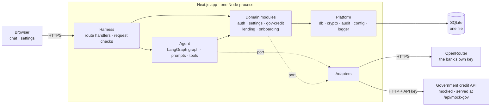
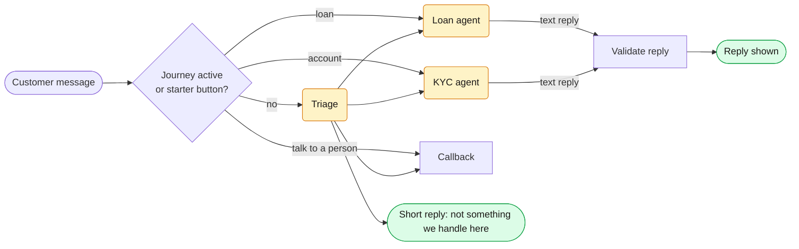
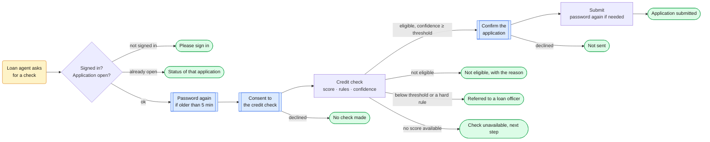
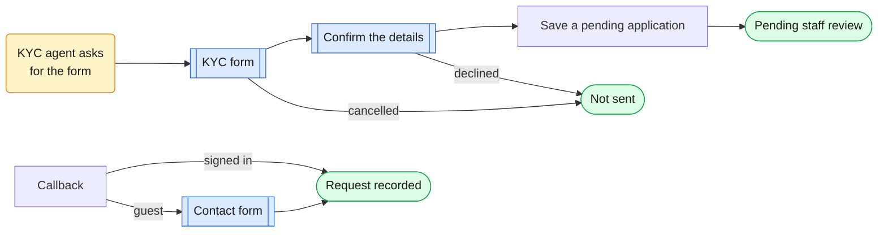
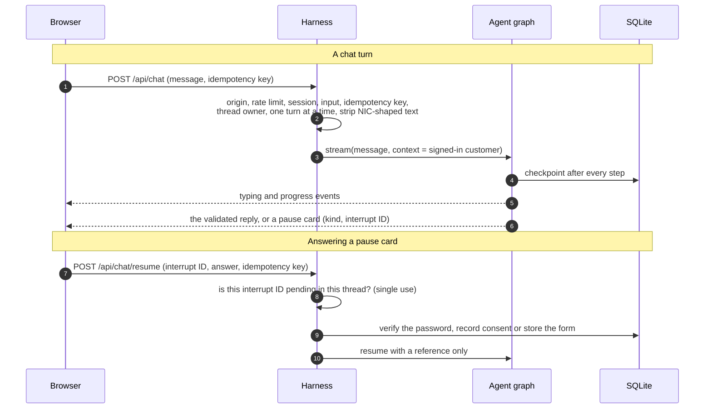
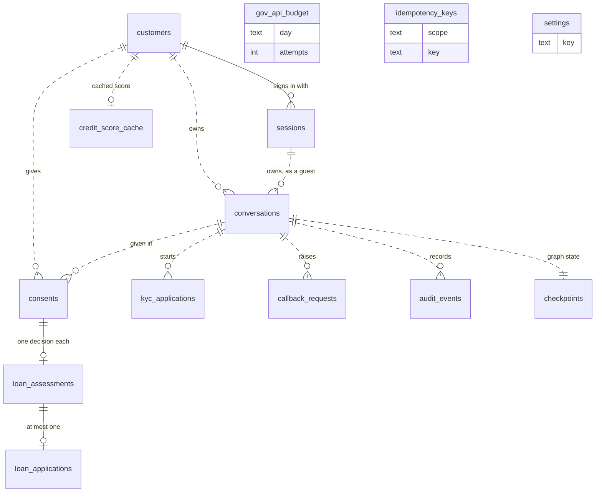
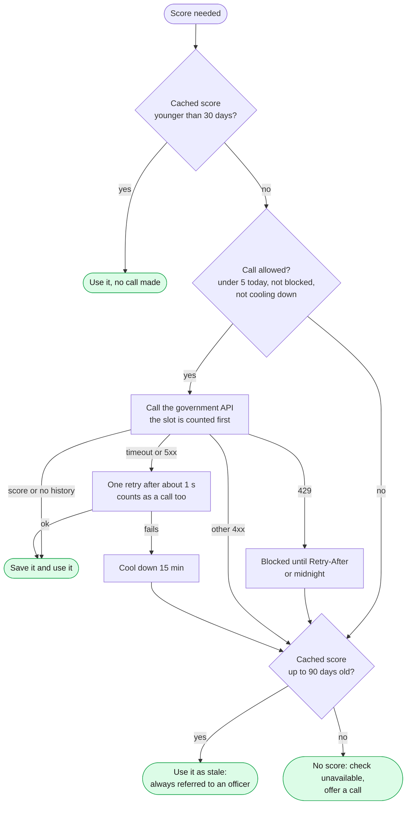

# Architecture

The structure of the bank assistant and the rules that keep it that way. **What** the system does is in [`SPEC.md`](SPEC.md); **why** each choice was made is in [`DECISIONS.md`](DECISIONS.md).

**Principle: the LLM talks, code decides.** Identity, money, consent and data access are deterministic code paths. The LLM handles conversation and never holds a lever.

## 1. Constraints that shape the design

- A small bank: ~500 customers, 50–60 daily users. One instance and one database are enough.
- The government credit API allows 5 calls a day per IP and is unreliable. It must be treated as scarce and fallible.
- A credit score is sensitive. Identity can only come from a signed-in session, never from chat.
- The bank brings its own model key and may change models or providers.

## 2. Style

| Choice | In one line |
|---|---|
| **Modular monolith** | One Next.js app; feature modules with enforced boundaries instead of services |
| **Ports and adapters** | Domain code depends on interfaces; external systems plug in behind them |
| **Router agent** | Code plus a cheap classifier picks the specialist; each specialist sees only its own journey |

**Principles every design choice follows:**
1. **Saved state holds references, never secrets.** The server verifies passwords and stores form data; the graph only receives `{ verified: true }` or a record ID.
2. **Guarantees only where code enforces them.** P0 rules are proven by deterministic tests; evals measure quality targets, not guarantees.
3. **At-least-once, made safe by idempotency.** Side-effect keys come from business identity (conversation + assessment), so a replayed step finds its earlier result.
4. **Validate before display.** LLM replies are checked before they reach the browser.

## 3. System view



Solid arrows are direct calls. Dotted arrows go through a port (§5), so the domain code never knows which provider or endpoint sits behind it. The mocked government API runs in the same server but is reached over HTTP, exactly like the real one would be.

## 4. Dependency rules

Enforced by ESLint (`eslint.boundaries.mjs`): `import/no-restricted-paths` for layers and module privacy, which resolves each import to a file so relative paths and the `@/` alias are caught alike, and `no-restricted-imports` for banned packages.

| Layer | May import | Never imports |
|---|---|---|
| `app/` | harness, UI components | agent, modules, adapters, platform |
| `server/harness` | agent, modules (`index.ts` only), platform, composition root | adapters directly |
| `server/agent` | modules (`index.ts` only), its own ports, platform | harness, adapters |
| `server/modules/*` | their own ports, platform, other modules' `index.ts` (acyclic) | LangChain/LangGraph, agent, harness, adapters |
| `server/adapters` | port types, platform, external SDKs | domain logic |
| `server/platform` | nothing above it | everything above it |
| `server/mock-gov` | platform | anything else. Only its own route files (`app/api/mock-gov`) and the demo seed script import it; the app reaches it over HTTP like a real external API |

## 5. Ports and adapters

A module declares the port it needs; an adapter implements it for one external system. **`server/composition.ts` is the only file that knows which adapters are in use.**

| Port (owner) | Contract | Adapter today | Swapping it means |
|---|---|---|---|
| `CreditBureau` (gov-credit) | `fetchScore(nic)` returns a validated result; declares `callsPerDay` | `HttpGovBureau` (calls the mock) | A new endpoint, an API version or the real service is a new adapter. Cache, budget, backoff and fallback rules don't change |
| `ChatModelProvider` (agent) | `chatModel({ modelId, reasoningEffort, maxOutputTokens, needsStructuredOutput })` returns a LangChain chat model. The agent picks these per role; the adapter adds the provider's privacy settings and never retries on its own | `OpenRouterProvider` | A direct provider, Azure, or a self-hosted model |
| `ModelCatalog` (settings) | Lists tool-capable models with price and context | `OpenRouterCatalog` | Any other catalogue |
| `MockBureauAdmin` (settings) | `resetDailyLimit()`, `setFailureMode(mode)`: the demo controls on the mocked government service, over HTTP | `HttpMockBureauAdmin` | Nothing for the real service, which has no such controls; they exist only in demo mode |
| `Clock`, `IdGenerator` (platform) | `now()`, `newId()` | System | Deterministic fakes in tests |

For E2E only (`E2E_SCRIPTED_MODEL`), `ScriptedChatProvider` and `StaticModelCatalog` stand in for OpenRouter, so browser tests need no model key (TD25).

**The database is deliberately not behind a port.** Drizzle already isolates the SQL dialect, so moving to Postgres is a dialect change; a repository layer would add files without adding options.

## 6. Modules

| Module | Responsibility | Depends on | Owns |
|---|---|---|---|
| `platform` | DB client, field encryption, validated config, audit log, logger | — | `audit_events`, `idempotency_keys` |
| `auth` | Login, server-side sessions, lockout, step-up | platform | `customers`, `sessions` |
| `settings` | Model per agent, model catalogue, demo controls | platform | `settings` |
| `gov-credit` | Credit-score policy: cache, daily budget, backoff, stale fallback | platform | `credit_score_cache`, `gov_api_budget` |
| `lending` | Eligibility rules, confidence, assessments, applications, referrals | gov-credit, platform | `consents`, `loan_assessments`, `loan_applications` |
| `onboarding` | KYC validation, pending account applications | platform | `kyc_applications` |
| `agent` | Graph, prompts, tools, middleware | all modules | `conversations`, `callback_requests`, `checkpoints`, `writes` |
| `mock-gov` | The simulated government service | platform | `mock_gov_*` (separate on purpose) |

Build order follows the dependency column: platform → auth → settings, gov-credit → lending, onboarding → agent → web.

```
src/
  app/                  pages + thin route handlers
  components/           ui/ (shadcn) · chat/ · settings/
  server/
    harness/  agent/  modules/<id>/  adapters/  platform/  mock-gov/
    composition.ts      wires adapters to ports
```

## 7. Agent graph

Three LLM nodes (triage, loan, KYC), each with its own model. Everything else is code. The shapes mean the same thing in all three diagrams:

| Shape | Meaning |
|---|---|
| Amber, rounded | An LLM node |
| Plain rectangle | A code node |
| Blue, double-edged | A pause (`interrupt()`): the customer answers in a secure card, never in chat |
| Green pill | What the customer ends up seeing, always from a template |

**7.1 Routing a turn.** Routing is sticky: triage runs only when no journey is active, and the starter buttons skip it. A specialist hands the turn back to triage when the customer changes topic.



**7.2 Loan journey.** The loan agent can only ask for a check; every gate after that is code.



The password is checked again right before the score is used and right before submission, because it can go stale while a card is open. How the score itself is obtained is in §11.

**7.3 Account opening and callbacks.**



A pause card's answer goes to the server, which verifies or stores it and resumes the graph with a **reference only**: never through the LLM, never into saved state. A node that pauses does nothing before its `interrupt()`. The full node list, generated from the compiled graph, is in [`diagrams/agent-graph.mmd`](diagrams/agent-graph.mmd) (`pnpm graph:draw`).

| Mechanism | Used for |
|---|---|
| `contextSchema` + `ToolRuntime.context` | The harness supplies the customer's identity; tools take no identity arguments |
| `interrupt(…, { responseSchema })` + `Command({ resume: { [id]: … } })` | Six pause kinds: step-up, consent, confirm, KYC form, KYC confirm, callback contact form. Resume values are validated references, resumed by interrupt ID. An ID is single-use because it must still be pending in **that thread's** checkpoint, and only the conversation's owner can resume it; the turn lock (FR-WEB-03) stops two resumes racing |
| `Command({ goto, graph: Command.PARENT })` | Specialist → deterministic steps, and hand-back to triage. Returned by a specialist's tool; the specialist runs in a wrapper node that calls `agent.invoke` (proven in T4) |
| `Command({ goto })` from gate nodes | Gates: sign-in, an open application, step-up, consent. The hard referral rules and the confidence threshold run inside `lending`; the credit-check node only routes on the outcome it gets back |
| Conditional edges | Only at `START` (sticky routing) and after a specialist (a text reply goes to `validate_reply`) |
| `createAgent` middleware | Call limits, model retry, personal-data redaction, tool failure → situation label |
| Node `retryPolicy` / `timeout` / `errorHandler` | The credit-check node |
| SQLite checkpointer, `durability: "sync"` | Conversations survive restarts; a replayed step is safe because its side effects are idempotent |
| `stream()` with `custom` | Progress events written by code nodes through `config.writer`. LLM replies are buffered, validated, then read back from the checkpoint and sent whole (TD25) |
| `validate_reply` node | After a specialist's text reply: a claimed outcome must match the decision in state, or the reply is replaced by the template. A reply that mentions a score, a band or a line of its own instructions is replaced too. The message ID is kept, so the reducer swaps the text in place. This is a word-level check, so it is best-effort (SPEC P0-05) |

## 8. Request lifecycle



## 9. Database design

One SQLite file in WAL mode, with foreign keys on and a 5-second busy timeout. Each module declares its tables in a Drizzle schema, which is the single source for columns; the SQL migrations live in `drizzle/`. LangGraph's checkpointer creates its own two tables.



Solid lines are real foreign keys; there are three. Dotted lines are links the owning module enforces in code. Each table belongs to one module, and only that module writes it (§6).

| Owner | Table | Holds | Key constraints |
|---|---|---|---|
| platform | `audit_events` | The audit trail | Triggers refuse `UPDATE` and `DELETE`; written only through `platform/audit` |
| platform | `idempotency_keys` | Claimed HTTP idempotency keys | Primary key (scope, key); a reused key gets 409 |
| auth | `customers` | The bank record and credentials | `customer_number` unique; NIC encrypted; income and repayments may be missing (a hard referral) |
| auth | `sessions` | Server-side sessions, customer or guest | Token stored as a SHA-256 hash; foreign key to `customers` (empty for a guest) |
| settings | `settings` | The model chosen for each role | One row per key; no row means the default |
| gov-credit | `credit_score_cache` | The last government result per customer | One row per customer, keyed by customer ID, never the NIC |
| gov-credit | `gov_api_budget` | The bank-wide daily call budget, block and cool-down | A single row, updated inside an `IMMEDIATE` transaction |
| lending | `consents` | Consent for exact loan terms in one conversation | — |
| lending | `loan_assessments` | One decision, with its confidence and the threshold used | `consent_id` unique, with a foreign key: one assessment per consent. No score or band stored |
| lending | `loan_applications` | An approved or referred application | `assessment_id` unique, with a foreign key; a partial unique index allows one open application per customer |
| onboarding | `kyc_applications` | A KYC draft, then a pending application | The form is stored encrypted; confirming is idempotent by status |
| agent | `conversations` | Who owns each conversation, and its models | The ID is also the checkpointer's thread ID |
| agent | `callback_requests` | "Talk to a person" requests | Unique (conversation, reason); a guest's contact details are encrypted |
| agent | `checkpoints`, `writes` | Graph state and transcripts | Created by the LangGraph checkpointer; hold references only (§10) |
| mock-gov | `mock_gov_citizens`, `mock_gov_ip_calls`, `mock_gov_settings` | The simulated government service | Kept apart from the bank's tables: in production this data lives at the government, not here |

**Integrity rules**

- **One decision, one record.** A decision and its audit event are written in one transaction, so neither exists without the other.
- **Replays find their first result.** Inside the graph, keys come from business identity: a consent gets one assessment, an assessment one application, a conversation one callback per reason. Replaying a step finds the row it wrote the first time. At the HTTP edge, a reused idempotency key gets 409.
- **No sixth call.** A government call slot is taken inside an `IMMEDIATE` transaction, so two requests can't both take the last one.
- **At rest.** NICs, KYC forms and guest contact details are encrypted with AES-256-GCM. Session tokens are stored hashed, and passwords with `scrypt`. The cached score is a plain integer because the rules read it, but it never reaches the audit, the logs or the LLM.
- **Enums in code.** Status values are checked in TypeScript, not with SQL `CHECK` constraints.

## 10. Security architecture

| Trust boundary | Mechanism |
|---|---|
| Browser ↔ app | HTTPS + HSTS in production; strict security headers; `SameSite=Strict` cookies + origin check |
| Who the customer is | Server-side sessions (hashed tokens, rotation, revocable logout); step-up re-authentication before the credit check and loan submission; identity never from chat |
| Saved graph state | References only: no passwords, form data, or NIC-shaped text (stripped before the graph) |
| Repeated or replayed requests | Idempotency keys (a reused key gets 409); single-use interrupt IDs that only the conversation's owner can resume |
| App ↔ external APIs | HTTPS to OpenRouter. The government API (mocked in this app) is called with the bank's API key, and its answers are validated with zod before use |
| The LLM | Least information (§11) and no authority: it can't approve, consent, resume a pause, or choose an identity |
| Secrets | Env only; the app refuses to start on invalid security config |

## 11. Failure handling

**Severity**, which sets the test obligation for every failure case in the spec:

| Level | Meaning | Obligation |
|---|---|---|
| **P0** | Could leak data, give a wrong or unauthorised outcome, duplicate an action, or bypass verification | Must never happen where code can prevent it; a best-effort check of free text is labelled as such. An automated test blocks the merge; a manual mutant shows the test fails when the control breaks |
| **P1** | A journey can't complete or visibly degrades | Must fail safe with an honest message and a next step. Automated test where the failure path is our code; the spec marks the few covered by review instead (TD28) |
| **P2** | A fallback already exists | Tested where cheap |

**Three audiences:**

| Audience | Gets |
|---|---|
| Customer | A written template and a next step. Hard failures add a short reference code for support |
| LLM | One **situation label** (e.g. `CHECK_UNAVAILABLE`, `REFERRED`, `INVALID_INPUT`), never error details, internal numbers, or personal data |
| Logs and audit | Full detail, personal data redacted, under the same reference |

**External dependencies degrade in one pattern:** bounded retry with backoff → cool-down → last good data (if the business rules allow it) → an honest "not available" with a human next step. Raw errors are mapped at one place: the tool middleware for the LLM, the harness for the browser.

The credit score is that pattern in full, because the government API is the scarcest resource in the system (5 calls a day):



Every step lands in the audit trail (served from cache, call N of 5, call skipped and why), which is what the demo panel shows.

## 12. Observability and runtime

- **Audit log:** append-only (§9). It records each model reply (role, model, prompt version, tool names, tokens; never the text), every auth event, consent, tool call, decision and government call. Transcript text lives only in the checkpoint.
- **Reading it:** `pnpm audit:trail <customer number | conversation ID | reference code>` prints one case as a plain-English timeline. In demo mode the chat's *Behind the scenes* panel shows the same timeline (SPEC §5, DECISIONS B10).
- **Logs:** structured JSON. Logs and audit share a correlation ID, which is also the reference code a customer can quote to support.
- **Runtime:** one Node 25 instance and one SQLite file, with TLS terminated at a reverse proxy.

**Scaling.** One instance is plenty for 50–60 daily users. This is what changes as load grows:

| Part | Today | At a second instance, or 10× the users |
|---|---|---|
| Database | One SQLite file | Postgres. Drizzle makes it a dialect change, and modules reach storage only through `platform/db` (D5) |
| Turn lock and rate limits | In process memory | A shared store (a Postgres row lock or Redis), so two instances can't run the same conversation |
| Sessions, checkpoints, audit | Already in the database | Nothing |
| Government credit calls | 5 a day for the whole bank: about 150 fresh checks per 30 days with the cache | The real ceiling. More instances don't raise it; the cache does, and past that only a bigger quota from the government will |
| LLM cost | About $22 a month on the default models (TD6) | Grows in line with turns. The per-role model choice in Settings is the lever |
