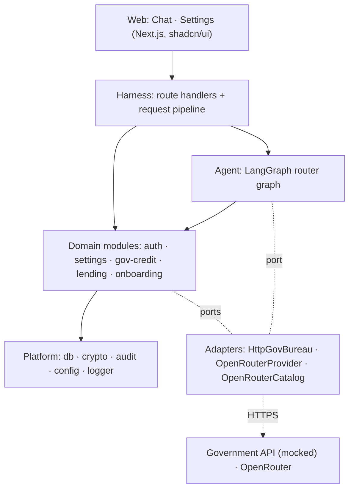
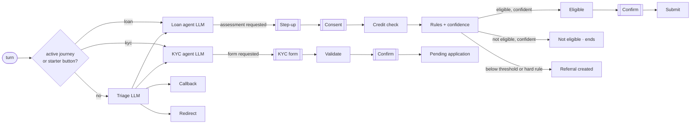
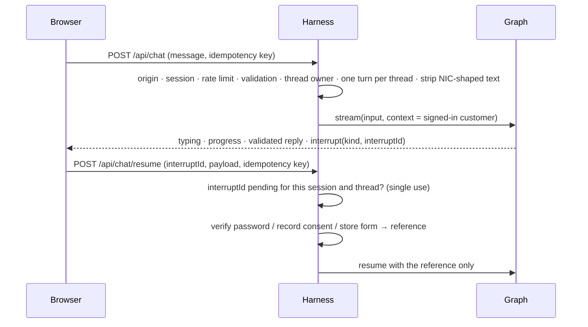
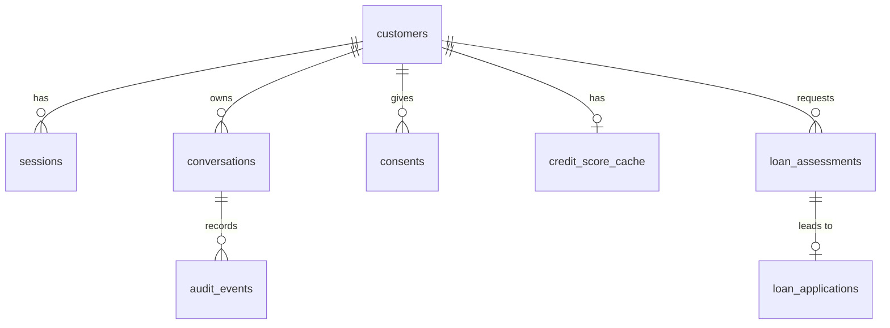

# Architecture

The structure of the bank assistant and the rules that keep it that way. **What** the system does is in [`SPEC.md`](SPEC.md); **why** each choice was made is in [`DECISIONS.md`](DECISIONS.md).

**Principle: the LLM talks, code decides.** Identity, money, consent and data access are deterministic code paths. The LLM handles conversation and never holds a lever.

## 1. Constraints that shape the design

- A small bank: ~500 customers, 50–60 daily users. One instance and one database are enough.
- The government credit API allows 5 calls a day per IP and is unreliable. It must be treated as scarce and fallible.
- A credit score is sensitive. Identity can only come from a signed-in session, never from chat.
- The bank brings its own model key and may change models or providers.

## 2. Style

| Choice | In one line |
|---|---|
| **Modular monolith** | One Next.js app; feature modules with enforced boundaries instead of services |
| **Ports and adapters** | Domain code depends on interfaces; external systems plug in behind them |
| **Router agent** | Code plus a cheap classifier picks the specialist; each specialist sees only its own journey |

**Principles every design choice follows:**
1. **Saved state holds references, never secrets.** The server verifies passwords and stores form data; the graph only receives `{ verified: true }` or a record ID.
2. **Guarantees only where code enforces them.** P0 rules are proven by deterministic tests; evals measure quality targets, not guarantees.
3. **At-least-once, made safe by idempotency.** Side-effect keys come from business identity (conversation + assessment), so a replayed step finds its earlier result.
4. **Validate before display.** LLM replies are checked before they reach the browser.

## 3. System view



## 4. Dependency rules

Enforced by ESLint (`eslint.boundaries.mjs`): `import/no-restricted-paths` for layers and module privacy, which resolves each import to a file so relative paths and the `@/` alias are caught alike, and `no-restricted-imports` for banned packages.

| Layer | May import | Never imports |
|---|---|---|
| `app/` | harness, UI components | agent, modules, adapters, platform |
| `server/harness` | agent, modules (`index.ts` only), platform, composition root | adapters directly |
| `server/agent` | modules (`index.ts` only), its own ports, platform | harness, adapters |
| `server/modules/*` | their own ports, platform, other modules' `index.ts` (acyclic) | LangChain/LangGraph, agent, harness, adapters |
| `server/adapters` | port types, platform, external SDKs | domain logic |
| `server/platform` | nothing above it | everything above it |
| `server/mock-gov` | platform | anything else. Only its own route files (`app/api/mock-gov`) import it; everything else reaches it over HTTP like a real external API |

## 5. Ports and adapters

A module declares the port it needs; an adapter implements it for one external system. **`server/composition.ts` is the only file that knows which adapters are in use.**

| Port (owner) | Contract | Adapter today | Swapping it means |
|---|---|---|---|
| `CreditBureau` (gov-credit) | `fetchScore(nic)` returns a validated result; declares `callsPerDay` | `HttpGovBureau` (calls the mock) | A new endpoint, an API version or the real service is a new adapter. Cache, budget, backoff and fallback rules don't change |
| `ChatModelProvider` (agent) | `chatModel({ modelId, reasoningEffort, maxOutputTokens })` returns a LangChain chat model. The agent picks those three per role; the adapter adds the provider's privacy settings and never retries on its own | `OpenRouterProvider` | A direct provider, Azure, or a self-hosted model |
| `ModelCatalog` (settings) | Lists tool-capable models with price and context | `OpenRouterCatalog` | Any other catalogue |
| `Clock`, `IdGenerator` (platform) | `now()`, `newId()` | System | Deterministic fakes in tests |

**The database is deliberately not behind a port.** Drizzle already isolates the SQL dialect, so moving to Postgres is a dialect change; a repository layer would add files without adding options.

## 6. Modules

| Module | Responsibility | Depends on | Owns |
|---|---|---|---|
| `platform` | DB client, field encryption, validated config, audit log, logger | — | `audit_events`, `idempotency_keys` |
| `auth` | Login, server-side sessions, lockout, step-up | platform | `customers`, `sessions` |
| `settings` | Model per agent, model catalogue, demo controls | platform | `settings` |
| `gov-credit` | Credit-score policy: cache, daily budget, backoff, stale fallback | platform | `credit_score_cache`, `gov_api_budget` |
| `lending` | Eligibility rules, confidence, assessments, applications, referrals | gov-credit, platform | `consents`, `loan_assessments`, `loan_applications` |
| `onboarding` | KYC validation, pending account applications | platform | `kyc_applications` |
| `agent` | Graph, prompts, tools, middleware | all modules | `conversations`, `callback_requests`, checkpoints |
| `mock-gov` | The simulated government service | platform | `mock_gov_*` (separate on purpose) |

Build order follows the dependency column: platform → auth → settings, gov-credit → lending, onboarding → agent → web.

```
src/
  app/                  pages + thin route handlers
  components/           ui/ (shadcn) · chat/ · settings/
  server/
    harness/  agent/  modules/<id>/  adapters/  platform/  mock-gov/
    composition.ts      wires adapters to ports
```

## 7. Agent graph



- **LLM nodes:** triage, loan and KYC (three roles, model chosen per role). Everything else is code.
- **`[[ ]]` = `interrupt()`.** The UI shows a secure input. The answer goes to the server, which verifies or stores it and resumes the graph with a **reference only**: never through the LLM, never into saved state. A node that pauses does nothing before its `interrupt()`.
- **Routing is sticky:** triage runs only when no journey is active or the topic changes; starter buttons skip it.

| Mechanism | Used for |
|---|---|
| `contextSchema` + `ToolRuntime.context` | The harness supplies the customer's identity; tools take no identity arguments |
| `interrupt(…, { responseSchema })` + `Command({ resume: { [id]: … } })` | Step-up, consent, KYC form, confirmation. Resume values are validated references, resumed by interrupt ID. An ID is single-use because it must still be pending in **that thread's** checkpoint; the turn lock (FR-WEB-03) stops two resumes racing |
| `Command({ goto, graph: Command.PARENT })` | Specialist → deterministic steps, and hand-back to triage. Returned by a specialist's tool; the specialist runs in a wrapper node that calls `agent.invoke` (proven in T4) |
| Conditional edges | Gates: sign-in, consent, hard referral rules, confidence threshold |
| `createAgent` middleware | Call limits, model retry, personal-data redaction, tool failure → situation label |
| Node `retryPolicy` / `timeout` / `errorHandler` | The credit-check node |
| SQLite checkpointer, `durability: "sync"` | Conversations survive restarts; a replayed step is safe because its side effects are idempotent |
| `stream()` with `custom` | Progress events written by code nodes through `config.writer`. LLM replies are buffered, validated, then read back from the checkpoint and sent whole (TD25) |
| `validate_reply` node | After a specialist's text reply: decision wording with no decision in state is replaced by the template, keeping the message ID so the reducer swaps it in place |

## 8. Request lifecycle



## 9. Data



- **Ownership:** only the owning module writes its tables (§6). Others call its public functions.
- **At rest:** NIC and KYC fields are encrypted (AES-256-GCM); session tokens are stored hashed; passwords use `scrypt`.
- **Integrity:** every state-changing action has an idempotency key with a unique constraint; keys for steps inside the graph are derived from business identity, so replays find the earlier result. A decision and its audit record are written in one transaction. An application can only come from an assessment.
- Column-level detail lives in the Drizzle schema, which is the single source.

## 10. Security architecture

| Trust boundary | Mechanism |
|---|---|
| Browser ↔ app | HTTPS + HSTS in production; strict security headers; `SameSite=Strict` cookies + origin check |
| Who the customer is | Server-side sessions (hashed tokens, rotation, revocable logout); step-up re-authentication before the credit check and loan submission; identity never from chat |
| Saved graph state | References only: no passwords, form data, or NIC-shaped text (stripped before the graph) |
| Repeated or replayed requests | Idempotency keys; single-use interrupt IDs bound to session and thread |
| App ↔ external APIs | TLS to allowlisted hosts; every response validated before use |
| The LLM | Least information (§11) and no authority: it can't approve, consent, resume a pause, or choose an identity |
| Secrets | Env only; the app refuses to start on invalid security config |

## 11. Failure handling

**Severity**, which sets the test obligation for every failure case in the spec:

| Level | Meaning | Obligation |
|---|---|---|
| **P0** | Could leak data, give a wrong or unauthorised outcome, duplicate an action, or bypass verification | Must never happen. An automated test blocks the merge; a manual mutant shows the test fails when the control breaks |
| **P1** | A journey can't complete or visibly degrades | Must fail safe with an honest message and a next step. Automated test |
| **P2** | A fallback already exists | Tested where cheap |

**Three audiences:**

| Audience | Gets |
|---|---|
| Customer | A written template and a next step. Hard failures add a short reference code for support |
| LLM | One **situation label** (e.g. `CHECK_UNAVAILABLE_TODAY`, `REFERRED`, `INVALID_INPUT`), never error details, internal numbers, or personal data |
| Logs and audit | Full detail, personal data redacted, under the same reference |

**P0 guarantees come from code and deterministic tests, never from evals.**

**External dependencies degrade in one pattern:** bounded retry with backoff → cool-down → last good data (if the business rules allow it) → an honest "not available" with a human next step. Raw errors are mapped at one place: the tool middleware for the LLM, the harness for the browser.

## 12. Observability and runtime

- **Audit log:** append-only; every message, auth event, consent, tool call, decision and external call, plus the model and prompt version. `pnpm audit:trail <customer number | conversation ID | reference code>` prints one case as a plain-English timeline. **Logs:** structured JSON. Both share a correlation ID, which is also the customer's reference code.
- **Runtime:** one Node 25 instance, one SQLite file, TLS terminated at a reverse proxy. Growth path: Postgres plus a shared session store. Modules reach storage only through `platform/db`, so nothing else changes.
